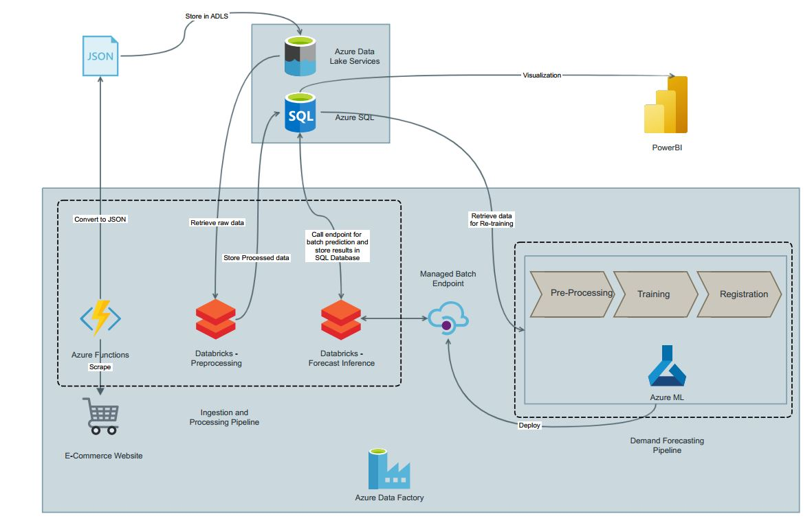
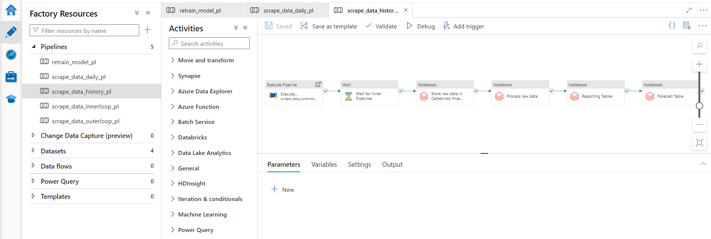
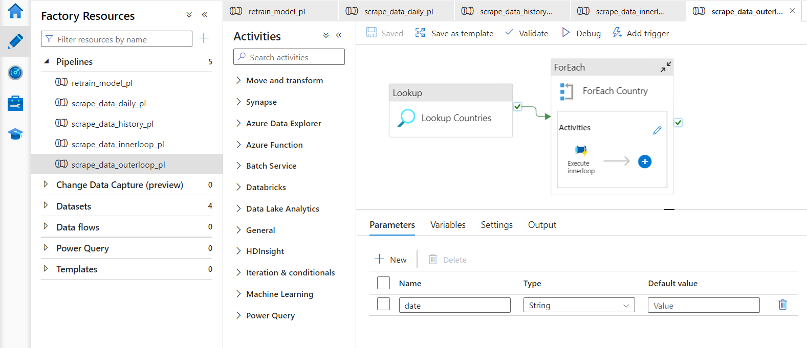
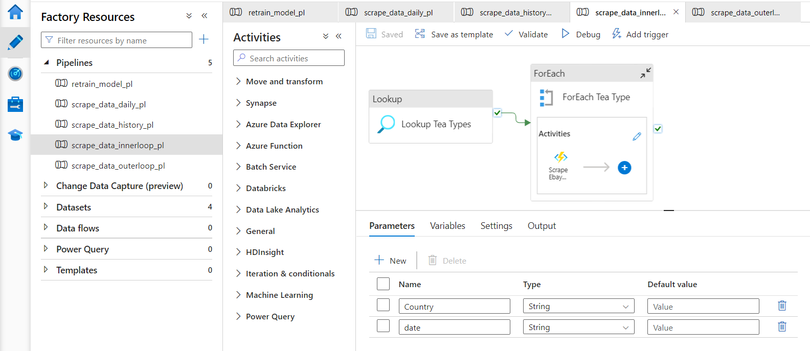
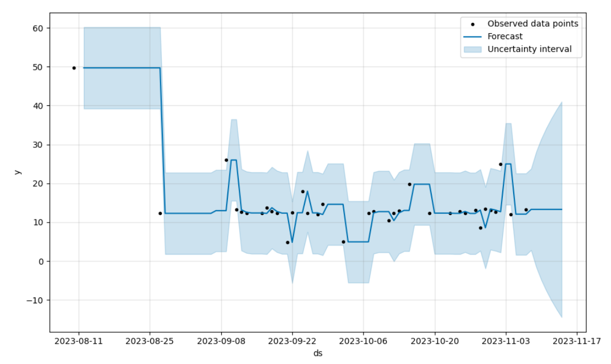
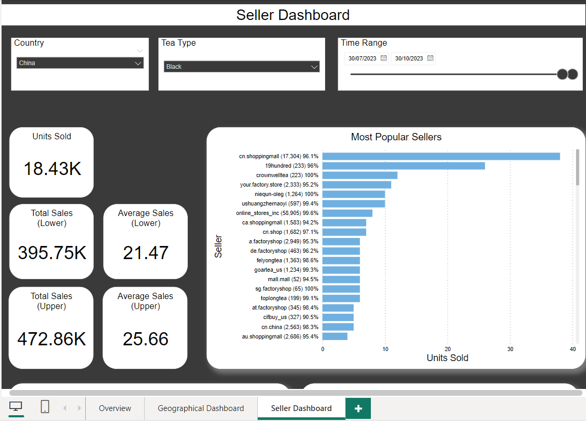
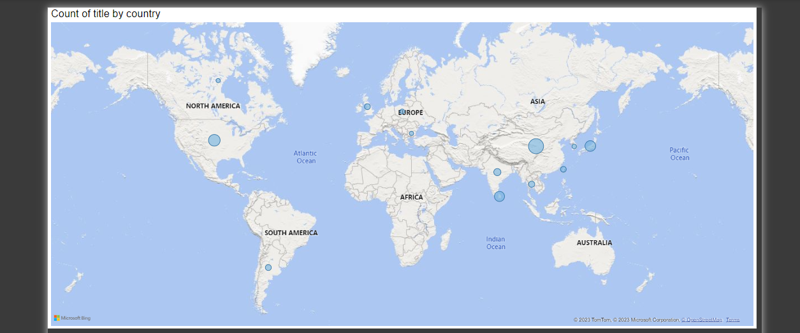
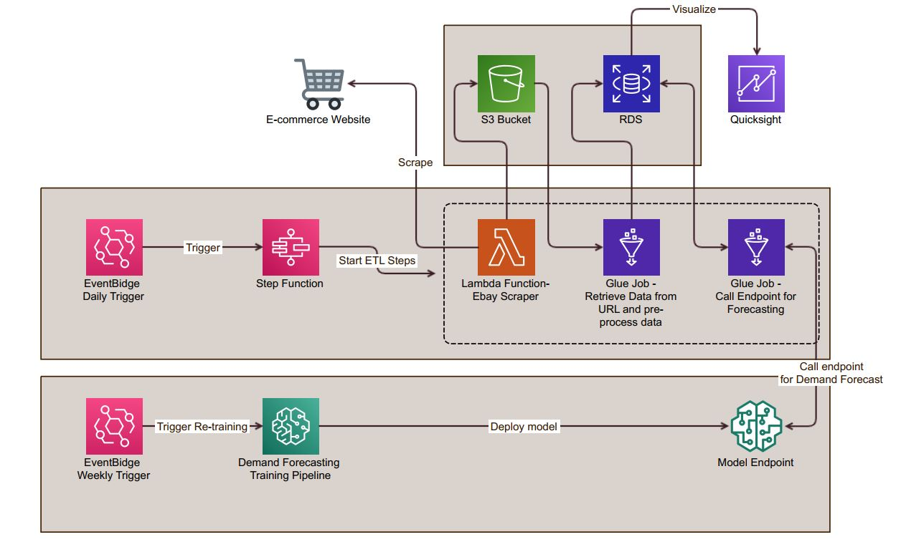

# Demand Forecasting Pipeline on Azure (and AWS)

This project is a comprehensive demand forecasting pipeline designed to help businesses make data-driven decisions by predicting future demand for products. It leverages Azure services for the initial development and has plans for an AWS implementation as well. The pipeline is designed to be flexible, scalable, and easy to maintain.

## Project Flow

The demand forecasting pipeline consists of several components that work seamlessly together:

1. **Azure Data Factory (ADF) Pipeline**
   - Triggered daily at a specific time to initiate the entire data flow.
   - Pipeline consists of an outer pipeline calling lookup and forEach function for each country. Inside the ForEach activity lies an inner pipeline that calls the Azure Function for each Tea Type.
   

   
   
   

3. **Azure Functions**
   - Scrapes eBay for sold products across various categories, collecting item details and URLs.
   - Converts the scraped data into a JSON file.
   - Comes with Github Actions CICD pipeline for deployment to Azure Functions webapp from local.

4. **Azure Blob Storage**
   - The JSON file is stream-uploaded to Azure Blob Storage for temporary storage.

5. **Databricks Notebook (Transformation)**
   - Retrieves the data from Azure Blob Storage and performs various transformations, including:
     - Further data extraction by visiting the URL for each product.
     - Natural Language Processing (NLP) for text analysis.
     - Feature engineering for time series predictions.

6. **Azure SQL Database**
   - Stores the structured data transformed by the Databricks notebook.

7. **Databricks Notebook (Demand Forecasting)**
   - Retrieves data from Azure SQL Database and makes calls to an ML endpoint for demand forecasting.
   - The forecasted data is then stored back in Azure SQL.
   - The model is trained using AutoML.
      

8. **Power BI Dashboard**
   - Visualizes the demand forecasting data, providing users with valuable insights.

      
    
   
10. **Weekly ADF Pipeline (Re-training)**
   - Triggered once a week to update the ML model.
   - Extracts data from Azure SQL and uses it to train a time-series model on Azure Machine Learning.

11. **Azure Machine Learning (AML) Model Deployment**
   - Deploys the trained model on Azure for real-time demand forecasting.

## Future Expansion (AWS)

In the future, the project aims to expand to AWS by implementing a similar pipeline. The AWS implementation will include the following services:

- **Amazon S3** for storage.
- **AWS Lambda** for serverless execution.
- **AWS Step Functions** for orchestration.
- **Amazon EventBridge** for event-driven architecture.
- **Amazon SageMaker** for machine learning model training.
- **AWS Glue** for ETL (Extract, Transform, Load) tasks.
- **Amazon QuickSight** for data visualization.

## License

This project is licensed under the MIT License.

---
